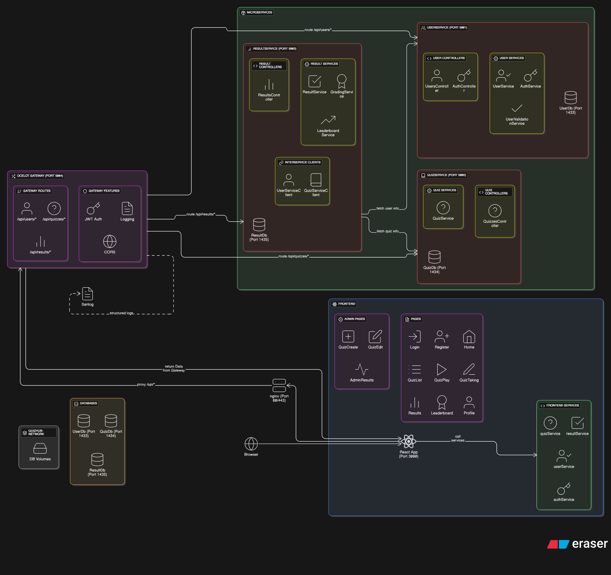

# QuizHub



A modern quiz application built with microservices architecture, featuring a React frontend and .NET Core backend services.

## Table of Contents
- [Prerequisites](#prerequisites)
- [Quick Start](#quick-start)
- [Architecture](#architecture)
- [Development Setup](#development-setup)
- [Build Instructions](#build-instructions)
- [Docker Management](#docker-management)
- [Environment Configuration](#environment-configuration)
- [Service Management](#service-management)
- [Troubleshooting](#troubleshooting)

## Prerequisites

- **Docker & Docker Compose** (for containerized deployment)
- **.NET 8.0 SDK** (for local development)
- **Node.js 18+** and **npm** (for frontend development)
- **SQL Server** (for local database development)

## Quick Start

### Docker Deployment (Recommended)

```bash
# Clone the repository
git clone <repository-url>
cd QuizHub

# Build and run all services
docker-compose up --build

# Access the application
# Frontend: http://localhost:3000
# API Gateway: http://localhost:5004
```

## Architecture

QuizHub uses a microservices architecture with the following components:

- **Frontend**: React TypeScript application with SCSS styling
- **Gateway**: API Gateway for routing and load balancing
- **UserService**: User management, authentication, and profiles
- **QuizService**: Quiz creation, management, and question handling
- **ResultService**: Quiz results, scoring, and leaderboards
- **Databases**: Separate SQL Server instances for each service

## Development Setup

### Backend Services (Local Development)

#### 1. Start Databases
```bash
# Start only the databases
docker-compose up user-db quiz-db result-db -d
```

#### 2. Run Services Individually
```bash
# User Service
cd Services/UserService/UserService.Api
dotnet restore
dotnet run

# Quiz Service  
cd Services/QuizService/QuizService.Api
dotnet restore
dotnet run

# Result Service
cd Services/ResultService/ResultService.Api
dotnet restore
dotnet run

# Gateway
cd Services/Gateway/Gateway.Api
dotnet restore
dotnet run
```

### Frontend (Local Development)

```bash
cd frontend

# Install dependencies
npm install

# Create environment file
cp .env.example .env

# Update .env for local development:
# REACT_APP_API_BASE_URL=http://localhost:5004/api
# REACT_APP_IS_PRODUCTION=false

# Start development server
npm start

# Application will be available at http://localhost:3000
```

## Build Instructions

### Building Individual Services

```bash
# User Service
cd Services/UserService/UserService.Api
dotnet build --configuration Release

# Quiz Service
cd Services/QuizService/QuizService.Api
dotnet build --configuration Release

# Result Service
cd Services/ResultService/ResultService.Api
dotnet build --configuration Release

# Gateway
cd Services/Gateway/Gateway.Api
dotnet build --configuration Release
```

### Building Frontend

```bash
cd frontend

# Install dependencies
npm install

# Build for production
npm run build

# The build artifacts will be in the 'build' directory
```

### Building Docker Images

```bash
# Build all services
docker-compose build

# Build specific service
docker-compose build user-service
docker-compose build quiz-service
docker-compose build results-service
docker-compose build gateway
docker-compose build frontend

# Build with no cache
docker-compose build --no-cache
```

## Docker Management

### Running Services

```bash
# Start all services
docker-compose up

# Start in detached mode
docker-compose up -d

# Start specific services
docker-compose up gateway user-service quiz-service

# Rebuild and start
docker-compose up --build
```

### Checking Service Status

```bash
# View running containers
docker-compose ps

# View service logs
docker-compose logs

# View logs for specific service
docker-compose logs user-service
docker-compose logs frontend
docker-compose logs gateway

# Follow logs in real-time
docker-compose logs -f

# View logs with timestamps
docker-compose logs -t
```

### Managing Services

```bash
# Stop all services
docker-compose down

# Stop and remove volumes (WARNING: This will delete all data)
docker-compose down -v

# Restart services
docker-compose restart

# Restart specific service
docker-compose restart user-service

# Scale services (if needed)
docker-compose up --scale user-service=2
```

### Database Management

```bash
# Access database containers
docker exec -it user-db /opt/mssql-tools/bin/sqlcmd -S localhost -U sa -P 'YourStrong!Passw0rd'
docker exec -it quiz-db /opt/mssql-tools/bin/sqlcmd -S localhost -U sa -P 'YourStrong!Passw0rd'
docker exec -it result-db /opt/mssql-tools/bin/sqlcmd -S localhost -U sa -P 'YourStrong!Passw0rd'

# View database logs
docker-compose logs user-db
docker-compose logs quiz-db
docker-compose logs result-db
```

## Environment Configuration

### Frontend Environment Variables

Create a `.env` file in the `frontend` directory:

#### Development (.env)
```env
REACT_APP_API_BASE_URL=http://localhost:5004/api
REACT_APP_IS_PRODUCTION=false
```

#### Docker/Production (.env)
```env
REACT_APP_API_BASE_URL=/api
REACT_APP_IS_PRODUCTION=true
```

### Backend Configuration

Each service uses `appsettings.json` and `appsettings.Development.json` for configuration:

```json
{
  "ConnectionStrings": {
    "DefaultConnection": "Server=localhost,1433;Database=UserDb;User Id=sa;Password=YourStrong!Passw0rd;TrustServerCertificate=true;"
  },
  "JwtSettings": {
    "SecretKey": "your-secret-key",
    "Issuer": "QuizHub",
    "Audience": "QuizHub",
    "ExpirationMinutes": 60
  }
}
```

### Docker Environment Variables

Services are configured via `docker-compose.yml`:
- Database connection strings
- ASPNETCORE_ENVIRONMENT=Production
- Database passwords and settings

## Service Management

### Health Checks

```bash
# Check if services are responding
curl http://localhost:5004/health  # Gateway
curl http://localhost:3000         # Frontend

# Check service-specific endpoints
curl http://localhost:5004/api/users/health
curl http://localhost:5004/api/quizzes/health  
curl http://localhost:5004/api/results/health
```

### Port Mapping

- **Frontend**: http://localhost:3000
- **Gateway**: http://localhost:5004  
- **User Database**: localhost:1433
- **Quiz Database**: localhost:1434
- **Result Database**: localhost:1435

### API Documentation

When running services locally in development mode, Swagger UI is available at:
- **User Service**: http://localhost:5001/swagger (custom profile) or http://localhost:5242/swagger (default)
- **Quiz Service**: http://localhost:5002/swagger (custom profile) or http://localhost:5083/swagger (default)
- **Result Service**: http://localhost:5003/swagger (custom profile) or http://localhost:5064/swagger (default)

**Note**: 
- Swagger UI is only available in development mode 
- Gateway service uses Ocelot and doesn't have Swagger UI
- Each service has custom launch profiles configured for consistent port numbering
- In production (Docker), all API calls should go through the Gateway at http://localhost:5004/api/

## Troubleshooting

### Common Issues

#### 1. Docker Networking Issues
If frontend can't connect to backend services:
- Ensure all services are running: `docker-compose ps`
- Check nginx configuration in `frontend/nginx.conf`
- Verify `.env` uses `/api` for Docker deployment

#### 2. Database Connection Issues
- Verify database containers are running: `docker-compose ps`
- Check connection strings in docker-compose.yml
- Ensure passwords match between services and databases

#### 3. Build Issues
```bash
# Clean Docker system
docker system prune -a

# Rebuild from scratch
docker-compose build --no-cache
docker-compose up
```

#### 4. Frontend Issues
```bash
# Clear npm cache
npm cache clean --force

# Delete node_modules and reinstall
rm -rf node_modules package-lock.json
npm install
```

#### 5. Database Migration Issues
```bash
# Access service container and run migrations
docker exec -it <service-container> dotnet ef database update
```

### Logs and Debugging

```bash
# View all logs
docker-compose logs

# View logs for troubleshooting specific issues
docker-compose logs gateway    # API routing issues
docker-compose logs frontend   # UI issues  
docker-compose logs user-db    # Database connectivity

# Monitor logs in real-time
docker-compose logs -f
```

### Performance Monitoring

```bash
# Monitor container resource usage
docker stats

# View container processes
docker-compose top
```
